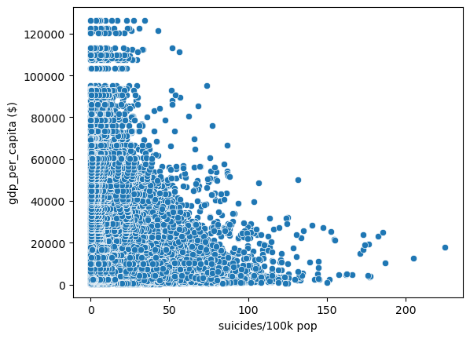
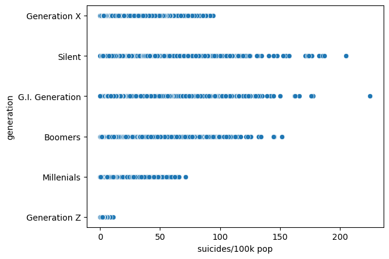
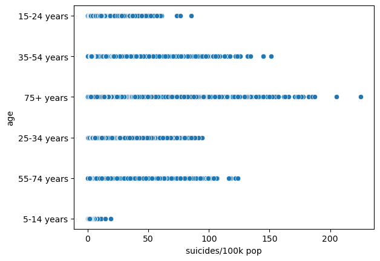
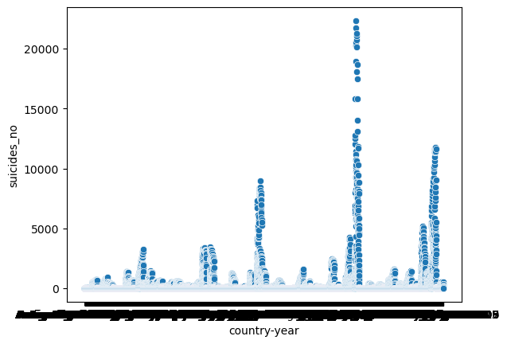
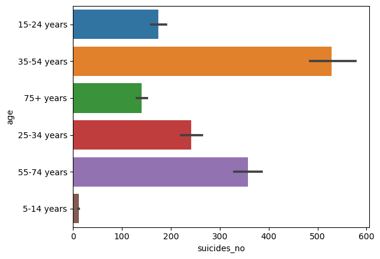

import pandas as pd 
import numpy as np 
import seaborn as sns
import matplotlib.pyplot as plt


```python
df = pd.read_csv('D:\DATA Analytics\Project\master.csv')
```


```python
df .head()
```


<div>
<style scoped>
    .dataframe tbody tr th:only-of-type {
        vertical-align: middle;
    }

    .dataframe tbody tr th {
        vertical-align: top;
    }

    .dataframe thead th {
        text-align: right;
    }
</style>
<table border="1" class="dataframe">
  <thead>
    <tr style="text-align: right;">
      <th></th>
      <th>country</th>
      <th>year</th>
      <th>sex</th>
      <th>age</th>
      <th>suicides_no</th>
      <th>population</th>
      <th>suicides/100k pop</th>
      <th>country-year</th>
      <th>gdp_for_year ($)</th>
      <th>gdp_per_capita ($)</th>
      <th>generation</th>
    </tr>
  </thead>
  <tbody>
    <tr>
      <th>0</th>
      <td>Albania</td>
      <td>1987</td>
      <td>male</td>
      <td>15-24 years</td>
      <td>21</td>
      <td>312900</td>
      <td>6.71</td>
      <td>Albania1987</td>
      <td>2,156,624,900</td>
      <td>796</td>
      <td>Generation X</td>
    </tr>
    <tr>
      <th>1</th>
      <td>Albania</td>
      <td>1987</td>
      <td>male</td>
      <td>35-54 years</td>
      <td>16</td>
      <td>308000</td>
      <td>5.19</td>
      <td>Albania1987</td>
      <td>2,156,624,900</td>
      <td>796</td>
      <td>Silent</td>
    </tr>
    <tr>
      <th>2</th>
      <td>Albania</td>
      <td>1987</td>
      <td>female</td>
      <td>15-24 years</td>
      <td>14</td>
      <td>289700</td>
      <td>4.83</td>
      <td>Albania1987</td>
      <td>2,156,624,900</td>
      <td>796</td>
      <td>Generation X</td>
    </tr>
    <tr>
      <th>3</th>
      <td>Albania</td>
      <td>1987</td>
      <td>male</td>
      <td>75+ years</td>
      <td>1</td>
      <td>21800</td>
      <td>4.59</td>
      <td>Albania1987</td>
      <td>2,156,624,900</td>
      <td>796</td>
      <td>G.I. Generation</td>
    </tr>
    <tr>
      <th>4</th>
      <td>Albania</td>
      <td>1987</td>
      <td>male</td>
      <td>25-34 years</td>
      <td>9</td>
      <td>274300</td>
      <td>3.28</td>
      <td>Albania1987</td>
      <td>2,156,624,900</td>
      <td>796</td>
      <td>Boomers</td>
    </tr>
  </tbody>
</table>
</div>


```python
df .head()
```


<div>
<style scoped>
    .dataframe tbody tr th:only-of-type {
        vertical-align: middle;
    }

    .dataframe tbody tr th {
        vertical-align: top;
    }

    .dataframe thead th {
        text-align: right;
    }
</style>
<table border="1" class="dataframe">
  <thead>
    <tr style="text-align: right;">
      <th></th>
      <th>country</th>
      <th>year</th>
      <th>sex</th>
      <th>age</th>
      <th>suicides_no</th>
      <th>population</th>
      <th>suicides/100k pop</th>
      <th>country-year</th>
      <th>gdp_for_year ($)</th>
      <th>gdp_per_capita ($)</th>
      <th>generation</th>
    </tr>
  </thead>
  <tbody>
    <tr>
      <th>0</th>
      <td>Albania</td>
      <td>1987</td>
      <td>male</td>
      <td>15-24 years</td>
      <td>21</td>
      <td>312900</td>
      <td>6.71</td>
      <td>Albania1987</td>
      <td>2,156,624,900</td>
      <td>796</td>
      <td>Generation X</td>
    </tr>
    <tr>
      <th>1</th>
      <td>Albania</td>
      <td>1987</td>
      <td>male</td>
      <td>35-54 years</td>
      <td>16</td>
      <td>308000</td>
      <td>5.19</td>
      <td>Albania1987</td>
      <td>2,156,624,900</td>
      <td>796</td>
      <td>Silent</td>
    </tr>
    <tr>
      <th>2</th>
      <td>Albania</td>
      <td>1987</td>
      <td>female</td>
      <td>15-24 years</td>
      <td>14</td>
      <td>289700</td>
      <td>4.83</td>
      <td>Albania1987</td>
      <td>2,156,624,900</td>
      <td>796</td>
      <td>Generation X</td>
    </tr>
    <tr>
      <th>3</th>
      <td>Albania</td>
      <td>1987</td>
      <td>male</td>
      <td>75+ years</td>
      <td>1</td>
      <td>21800</td>
      <td>4.59</td>
      <td>Albania1987</td>
      <td>2,156,624,900</td>
      <td>796</td>
      <td>G.I. Generation</td>
    </tr>
    <tr>
      <th>4</th>
      <td>Albania</td>
      <td>1987</td>
      <td>male</td>
      <td>25-34 years</td>
      <td>9</td>
      <td>274300</td>
      <td>3.28</td>
      <td>Albania1987</td>
      <td>2,156,624,900</td>
      <td>796</td>
      <td>Boomers</td>
    </tr>
  </tbody>
</table>
</div>


```python
# Group the data by country and calculate the mean suicide rate
suicide_by_country = df.groupby("country")["suicides/100k pop"].mean()
```


```python
# Print the resulting DataFrame
print(suicide_by_country)
```

    country
    Albania                  3.502879
    Antigua and Barbuda      0.552901
    Argentina               10.469328
    Armenia                  3.275872
    Aruba                    9.503095
                              ...    
    United Arab Emirates     1.317917
    United Kingdom           7.502473
    United States           13.819812
    Uruguay                 19.461190
    Uzbekistan               8.099129
    Name: suicides/100k pop, Length: 101, dtype: float64
    


```python
highest_suicide_country = df['suicides/100k pop'].sort_values(ascending=False).head(1).index[0]
```


```python
# Sort the DataFrame by suicide rate in descending order
highest_suicide_rates = suicide_by_country.sort_values(ascending=False)
```


```python
# Print the top 10 countries with the highest suicide rates
print(highest_suicide_rates.head(10))
```

    country
    Lithuania             40.415573
    Sri Lanka             35.295152
    Russian Federation    34.892377
    Hungary               32.761516
    Belarus               31.075913
    Kazakhstan            30.511282
    Latvia                29.259325
    Slovenia              27.827857
    Estonia               27.276905
    Ukraine               26.582321
    Name: suicides/100k pop, dtype: float64
    


```python
# Sort the DataFrame by suicide rate in ascending order
lowest_suicide_rates = suicide_by_country.sort_values()
```


```python
# Print the top 10 countries with the lowest suicide rates
print(lowest_suicide_rates.head(10))
```

    country
    Saint Kitts and Nevis    0.000000
    Dominica                 0.000000
    Jamaica                  0.521765
    Antigua and Barbuda      0.552901
    Oman                     0.736111
    South Africa             0.964542
    Kuwait                   1.186433
    Bahamas                  1.247391
    United Arab Emirates     1.317917
    Maldives                 1.367333
    Name: suicides/100k pop, dtype: float64
    

We need to analyze the relationship between suicide rates and other variables like Generation and GDP per capita, I am uses scatterplots or heatmaps to visualize these relationships.


```python
# Create a scatterplot of suicide rate vs. GDP PER CAPITA
sns.scatterplot(x="suicides/100k pop", y="gdp_per_capita ($)", data=df)
plt.show()
```


    

    


This shows that the lower the GDP per CAPITA , the higher the suicidal tendies. The theory behind this is that as a country's GDP per capita increases, its citizens may experience increased pressure to succeed and keep up with the growing demands of modern life, which can lead to higher levels of stress and mental health issues.


```python
# Create a scatterplot of suicide rate vs. generation
sns.scatterplot(x="suicides/100k pop", y="generation", data=df)
plt.show()
```


    

    


People ages 45 to 64 still have the highest overall risk of suicide.

I felt immporatant to analyse the relationship between Age suicide rate.


```python
# Create a scatterplot of suicide rate vs. age 
sns.scatterplot(x="suicides/100k pop", y="age", data=df)
plt.show()
```


    

    


```python
This is a sad finding , is it not. !
```


```python
# Create a a bar plot suicide rate vs. age 
sns.scatterplot(x="country-year", y="suicides_no", data=df)
plt.show()
```


    

    


```python
fig = plt.figure(figsize = (10, 5))
```


    <Figure size 1000x500 with 0 Axes>


```python
sns.barplot(x="suicides_no", y="age", data=df)
plt.show()
```


    

    


Based on the analysis, it can be concluded that Lithuania has the highest suicide rate among the countries in the dataset, with a rate of 40.42 suicides per 100k population. It is also observed that people in the age group of 34-64 years and the g1 generation are most affected by suicide.

To address the high suicide rate in Lithuania, several recommendations can be made:

    Increase awareness: There is a need for greater awareness campaigns on suicide prevention measures. The government, civil society organizations, and healthcare providers should work together to educate the public on the warning signs of suicide and the available resources for help.

    Access to mental health services: There should be an increase in the availability and accessibility of mental health services in Lithuania, particularly for those in the high-risk age groups. The government should invest in expanding mental health services and training more mental health professionals.

    Address social and economic factors: It is important to address the social and economic factors that contribute to high suicide rates, such as unemployment, poverty, and social isolation. The government should work to create more job opportunities, provide social support services, and promote social inclusion.

    Monitoring and evaluation: There should be continuous monitoring and evaluation of suicide prevention programs and policies to determine their effectiveness and make necessary adjustments. This will help to ensure that resources are being used efficiently and effectively to prevent suicide.
Thus it is important to recognize that suicide is a complex issue that requires a multifaceted approach to prevention. The recommendations provided above are just a starting point, and continued efforts are needed to reduce the high suicide rate in Lithuania.


```python

```
